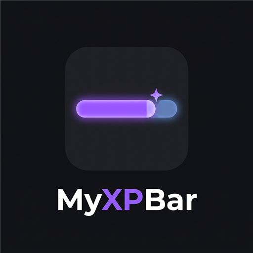

# MyXPBar Forever

**A clean, lightweight and fully customizable XP bar for World of Warcraft: Forever.**

-c8a14a)

---

MyXPBar replaces the default Blizzard experience bar with a sleek, readable bar you can place
anywhere on your screen. Inspired by the popular Luxthos WeakAuras look, it shows your rested XP,
estimates how many mobs you still need, and comes with a full in-game options menu built in the
World of Warcraft style. No libraries, no dependencies.

## Features

- **Replaces the Blizzard XP bar** — the default bar is hidden automatically, and comes back at max
  level for reputation and honor.
- **6 bar styles** — classic, gold framed, segmented, thin line, spark and split rested, switched in
  one click with a live preview.
- **Smooth and alive** — the bar slides to its new value, a floating `+245 XP` rises on every gain,
  and the bar flashes on level up. Both can be turned off.
- **Rested XP overlay** — a translucent layer shows exactly how far your rested XP will take you.
- **Mobs-to-level estimate** — how many kills you still need, based on your last XP gain.
- **Detailed stats** — level, current / max XP, percentage, and projected percentage with rested XP.
- **English and French** — switch language in one click from the options menu.
- **Settings that stick** — position, size, colors, style and options survive a reload, a relog
  and a full restart of the game, even with the Forever beta bug that resets other addons
  (see below).
- **Full screen width** — one click and the bar runs from one edge of the screen to the other,
  at any resolution.
- **Reputation on hover** — mouse over the bar to see your tracked reputation: faction, standing
  and progress.
- **Lightweight** — texts are only redrawn when they change, and nothing runs while the bar is
  hidden.

## Options menu

Open it from the **minimap button** or with **`/mxp`**. The menu is built in the World of Warcraft
style — stone frame, gold ornaments, gothic titles, Blizzard checkboxes — and every change is
applied live.

| Section | What you can change |
| --- | --- |
| Style | Classic, gold framed, segmented, thin line, spark, split rested |
| Size | Width (200 px up to the width of your screen) and height (8 to 60 px) |
| Colors | 8 quick colors or the full color wheel, for the XP bar and the rested XP, plus background opacity |
| Options | Lock the bar, hide the Blizzard bar, sound on XP gain, texts on the bar, rested text, smooth animation, floating +XP, minimap button, full screen width, reputation on hover |

## Installation

1. Download the latest release, or get it from
   [CurseForge](https://www.curseforge.com/wow/addons/myxpbar-forever).
2. Extract the `MyXPBar` folder into your WoW Forever `Interface\AddOns` directory:
   `World of Warcraft\<Forever folder>\Interface\AddOns\MyXPBar`
3. Launch the game. The folder **must** be named `MyXPBar`.

## Controls

- **Shift + left-click** and drag to move the bar (no Shift needed while the options menu is open).
- **Left-click** the minimap button to open the options.
- **Right-click** the minimap button to lock or unlock the bar.

## Slash commands

| Command | Description |
| --- | --- |
| `/mxp` or `/myxpbar` | Open / close the options menu |
| `/mxp debug` | Check the settings backup |

## About the Forever beta saving bug

During the WoW Forever beta, the client writes addon settings at logout but never reads them back
after a relog or a restart, so every addon starts from defaults. MyXPBar keeps two extra copies of
its settings:

- **Addon CVars** — they stay in memory while the game runs, which covers a relog. The client never
  writes them to disk, so they are gone once the game is closed.
- **One account macro named `MyXPBar`** — macros are stored by the server and are always there after
  a restart. It holds a single line of settings (about 80 characters) and does nothing if you click
  it. If you delete it, MyXPBar puts it back a few seconds later.

At login, the most recent copy wins. When Blizzard fixes the bug, the normal saved variables take
over again — nothing to change. The macro uses one of the 120 account macro slots; if they are all
taken, a chat message tells you.

## Compatibility

- **World of Warcraft: Forever** — 1.60.x, Interface `16001`
- The original 1.0 version was made for 3.3.5a / Project Ascension.

## Changelog

See [CHANGELOG.md](CHANGELOG.md).

## License

Free to use and modify. If you share a modified version, please credit the original addon.

---

Made by **Polarz141** · [CurseForge](https://www.curseforge.com/wow/addons/myxpbar-forever)

